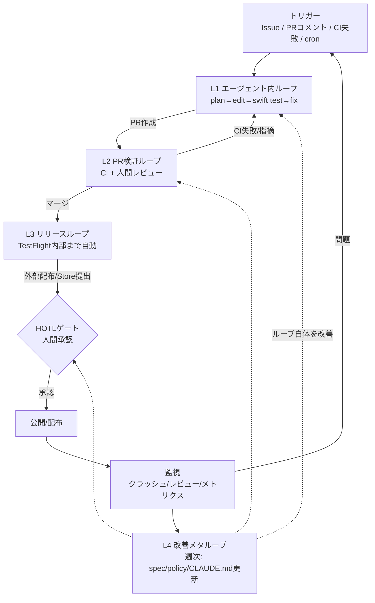

# ループ設計 — Xcode での iOS アプリ開発でどのようなループを組むか

> 観点1への回答。本ラボで検証・改善していくループの設計書。変更は C2(人間承認必須)。

## 設計原則

1. **検証可能性を最初に作る。** エージェントのループは「自分で結果を確認できる」ときだけ回る。テスト・ビルド・lint が無い作業は、エージェントにとって「一発勝負のプロンプト」に退化する。だからアプリ本体より先に検証系(このラボ)を整備する。
2. **フィードバック遅延で層を分ける。** 秒単位で回るもの(ユニットテスト)と、日単位でしか回らないもの(App Review)を同じループに入れない。層ごとにトリガー・検証・停止条件・責任者を定義する。
3. **Apple 境界はゲートとして設計する。** 署名・審査・申告は「自動化できない障害」ではなく「人間責任を置く場所を明確にしてくれる設計条件」として扱う(参照レポートの結論)。

## 最重要のアーキテクチャ決定: コアの SwiftPM 分離

アプリを次の2層に分ける。

| 層 | 内容 | ビルド/テスト環境 |
|---|---|---|
| **AppCore** (SwiftPM パッケージ) | ドメインロジック、状態管理、データ変換、課金/設定などのルール。UIKit/SwiftUI に依存しない純 Swift | **Linux でも `swift test` が通る** → リモートの安い環境でエージェントが高速に回せる |
| **AppShell** (Xcode プロジェクト) | SwiftUI ビュー、ライフサイクル、OS 統合(通知・課金 UI 等)。できる限り薄く保つ | macOS + Xcode(シミュレータ/実機) |

これが副業量産の生産性を決める。**「エージェントが夜中に Linux コンテナで自走できる面積」を最大化し、Mac と人間の時間を UI の質と Apple 手続きに集中させる。** Xcode プロジェクトは XcodeGen(`project.yml` をコミットし `.xcodeproj` は生成物)で管理し、エージェントがプロジェクト設定もテキストとして扱えるようにする。

## 4層ループ

### L1 — エージェント内ループ(秒〜分)
- **トリガー**: `agent:task` ラベルの Issue / 人間のプロンプト / PR へのレビューコメント・CI 失敗通知
- **実行**: plan → edit → `swift build` → `swift test` → observe → fix の反復
- **検証**: AppCore のユニットテスト、(後続フェーズで)swift-format / SwiftLint
- **停止条件**: 全テスト green / 試行上限(loop-spec 参照) / approval-policy 違反の検知
- **場所**: リモート Linux(Claude Code on the web)を既定。UI 作業のみローカル Mac

### L2 — PR 検証ループ(分〜時間)
- **トリガー**: PR 作成・更新
- **実行**: CI が ubuntu で AppCore テスト、(アプリ導入後)macOS ランナーで `xcodebuild build-for-testing` → `test-without-building`(分離して再試行を速く)。UI 変更はスクリーンショットを artifact 化
- **検証**: CI green + **人間レビュー(ここが主要 HOTL ゲート)**。人間はコード全行ではなく「PR テンプレートのエビデンス」と「人間に見てほしい点」を見る
- **停止条件**: CI 失敗の自動修正は 3 回まで。超えたら人間へエスカレーション

### L3 — リリースループ(日〜週)
- **トリガー**: main へのマージ / リリースタグ
- **実行**: (フェーズ2以降)fastlane で archive → 署名 → TestFlight **内部**配布まで自動。App Store Connect API key(最小権限)で 2FA 依存を排除
- **検証**: スモークテスト、クラッシュ監視
- **HOTL ゲート**: 外部 TestFlight 提出・App Store 提出・公開は**人間がボタンを押す**。エージェントはリリースノート・メタデータ・スクリーンショットのドラフトまで
- **停止条件**: クラッシュ率閾値超過で自動停止+人間へ通知(ロールバック判断は人間)

### L4 — 改善メタループ(週)
- **トリガー**: 週次レビュー(人間、15〜30分)
- **実行**: `metrics/loop-log.csv` と CI 履歴を見て、介入が多かった箇所・flake・コストを特定 → CLAUDE.md / loop-spec / approval-policy / テンプレートを更新(エージェントに起案させ、人間が承認)
- **これがラボの本体**。ループそのものを成果物として磨き、アプリ2本目以降に複製する

## 全体図

## フェーズ計画(このループをどう立ち上げるか)

| フェーズ | 内容 | 使う環境 | 対応実験 |
|---|---|---|---|
| **P0(今)** | ラボ基盤 + L1/L2 をリモートのみで検証(AppCore) | リモート Linux + ubuntu CI | E01 |
| **P1** | アプリ殻(XcodeGen + SwiftUI)を追加、macOS ランナーでシミュレータテスト、HOTL ゲート運用開始 | + ローカル Mac、macOS ランナー | E02, E03 |
| **P2** | fastlane + ASC API key で TestFlight 内部配布を自動化 | + 署名 secrets | E04 |
| **P3** | L4 を定常運用し、テンプレートリポジトリ(App Factory Kit)を切り出して2本目のアプリへ | 全部 | E05, E06 |

具体的な検証項目と成功基準は [validation-plan.md](validation-plan.md)、人間/AI の分担は [roles-and-gates.md](roles-and-gates.md)、環境の使い分けは [environments.md](environments.md) を参照。
