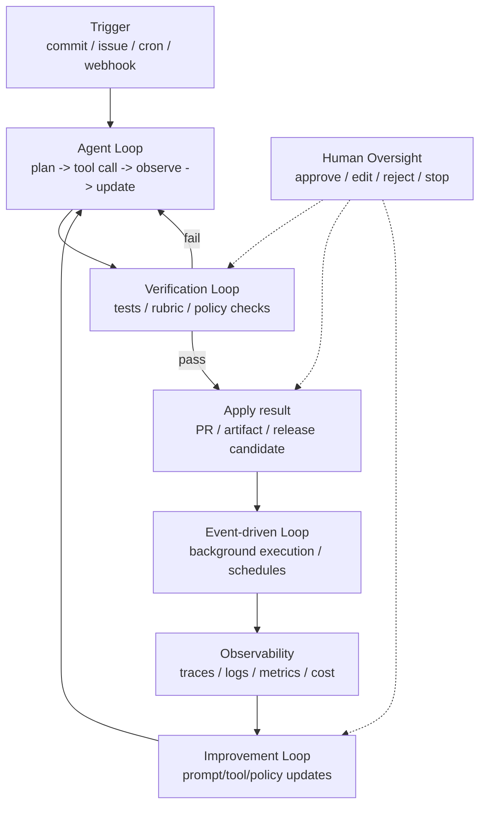
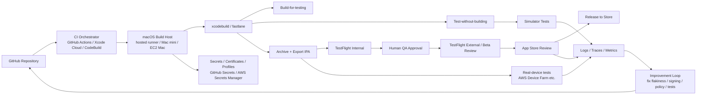
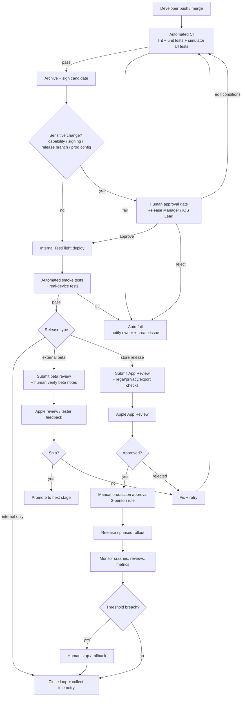

> [!NOTE]
> このファイルは本ラボの出発点となった調査レポート(2026-07 時点、ユーザー提供)の原本コピーである。
> 本文中の `citeturnXviewY` はリサーチツールの引用マーカーであり、原本のまま保存している。

# Loop engineering と Human-on-the-loop の実務分析レポート

## エグゼクティブサマリ

「Loop engineering」は、LLMやAIエージェントを**一回のプロンプト実行**として扱うのではなく、**トリガー、目標、検証、停止条件、記憶、権限制御、観測可能性**を備えた反復実行系として設計する実務領域である、という理解がもっとも有用です。歴史的には新語ですが、実体は古く、1970年代の**human supervisory control**、2000年の**levels of automation**、近年の**HITL/HOTL/HIC**、そして2022年以降の**ReAct・Self-Refine・Reflexion**などの反復推論・自己修正研究の延長線上にあります。2026年時点では、LangChain、OpenAI Codex、Anthropic Claude Code など主要プレイヤーが、単一の「agent loop」だけでなく、**verification loop・event-driven loop・improvement loop**まで含めて実装・製品化し始めており、Loop engineering は「プロンプトの書き方」よりも「制御系・検証系・運用系の設計」に重心が移っています。 citeturn29view0turn30search0turn27view0turn31view1turn22view0turn22view4turn22view6turn17view2

Human-on-the-loop は、毎回の判断に人間が介入する Human-in-the-loop と違い、**システムの設計・監視・異常時介入・停止権限**を人間が持つ方式です。EUの信頼できるAIガイドラインは、HITL/HOTL/HIC を明確に区別しており、2026年の体系的レビューでも、HOTL は**粗粒度・非同期・中程度リスクの運用**と相性が良く、逆に高リスクでは HITL 的な同期的・細粒度の介入が必要になりやすいことが示されています。実務上は、「何を自動で回し、どこで人間が止め、どこで承認し、どこを監査可能にするか」を決める設計思想として HOTL が重要です。 citeturn27view0turn27view1turn28view1turn28view5

iOSネイティブアプリを macOS 上で Swift 開発し、CI/CD まで「Loop」を回す文脈では、結論は比較的はっきりしています。**日常運用の大半は Xcode GUI なしで自動化できる**一方、**Appleアカウント権限、証明書・プロビジョニング、Capability 変更、App Privacy、輸出規制、外部TestFlight審査、App Review応答**などは、依然として人間やApple側審査を前提にした運用が必要です。したがって最適解は「完全自動化」ではなく、**xcodebuild/fastlane/CI サービスで実行ループを自動化しつつ、署名・配布・審査・本番公開には HOTL の承認ゲートを置く**ことです。 citeturn18view0turn23view0turn25view1turn18view3turn18view5turn17view4turn26view3turn18view9

実務的な推奨としては、短期は **Xcode Cloud または GitHub Actions + fastlane** でビルド・テスト・TestFlight 配布を標準化し、中期で **self-hosted Mac mini / EC2 Mac / CodeBuild for macOS** による再現性とセキュリティ統制を高め、長期では **policy-as-code、承認フロー、監査ログ、トレース評価、フェイルセーフ、自動改善ループ**まで含めた HOTL 運用へ拡張するのが現実的です。特に中小〜大規模アプリでは、**「自動化率」より「停止可能性・監査可能性・再現性」**を優先した方が失敗コストを抑えやすい、というのが本レポートの中心的な結論です。 citeturn25view0turn18view10turn17view7turn25view2turn18view12turn34search14turn35view0

## 概念整理と歴史的背景

Loop engineering という呼称自体はごく新しく、2026年のプレプリントでは、これを**「トリガー、目標、検証、停止条件、記憶から成る loop specification を、人間が agent harness に与える設計実務」**として定義しています。一方で、その基底にある発想は新しくありません。1975年の Sheridan は、すでに「人間が in-the-loop controller から supervisory controller に移り、計画・教育・監視・介入を担う」構図を記述していました。2000年の Parasuraman・Sheridan・Wickens は、人間と自動化の関係を「何をどこまで自動化するか」という**automation level**として整理しています。つまり、**Loop engineering は新語だが、問題設定自体は human supervisory control の現代的再解釈**と見るのが妥当です。 citeturn31view1turn31view2turn29view0turn30search0

その後、AIガバナンス文脈では、EUの信頼できるAIガイドラインが **HITL・HOTL・HIC** を明確に区別しました。ここで重要なのは、HITL が「毎回の判断サイクルへの介入能力」、HOTL が「設計段階への関与と運用監視」、HIC が「システム全体の使用可否と文脈を決める上位統治」であることです。さらに2026年の HITL レビューは、これらを**loop placement・interaction granularity・temporal characteristics** という三次元で整理し、同じ「人間関与」でも、同期性・粒度・コストがまったく異なることを示しました。 citeturn27view0turn27view1turn28view2turn28view3turn28view4

以下の比較表は、実務で混同されやすい概念を、設計責任・介入タイミング・主要ユースケースの軸で整理したものです。

| 概念 | 人間の役割 | 介入タイミング | 典型的な用途 | 実務上の意味 |
|---|---|---|---|---|
| Human-in-the-loop | 各意思決定サイクルに関与 | 同期的・高頻度 | 高リスク判断、医療、金融、危険操作 | 精度と責任を高めやすいが、スループットとコストが落ちる |
| Human-on-the-loop | 監視・異常時介入・停止権限 | 非同期・中頻度 | 運用監視、承認付き自動化、CI/CD、本番公開 | 通常時は自動、重要局面だけ人間が止める設計に向く |
| Human-in-command | 利用方針・適用範囲・権限を統治 | エピソード的・上位レイヤ | 組織ガバナンス、リスク委員会、プロダクト方針 | 「使うか・どこまで使うか」を最終的に人間が決める |
| Supervisory control | 人間は高位ループで計画・監視・介入 | 連続運転中の監督 | 自律システム、ロボティクス、産業制御 | HOTL/HIC の工学的原型 |
| Autonomous loop | 通常実行中の人手介入なしで、目標達成まで反復 | 事前設計＋事後監視 | コーディングエージェント、バックグラウンド処理、イベント駆動運用 | 標準用語ではないが、実務上は「無人運転区間を持つ loop」を指す整理が有用 |
| Ordinary programming loop | ソフトウェア構文としての for/while | プログラム実行中 | 一般プログラミング | Loop engineering と混同すべきでない |

表のうち HITL/HOTL/HIC の定義は EU のガイドラインに基づき、supervisory control は Sheridan に、interaction granularity と HOTL の適用レンジは 2026年レビューに基づきます。なお **autonomous loop** は標準化された学術用語ではないため、本レポートでは recent practitioner literature に沿って、「人手承認なしで一回の run を自己完結させる運用ループ」という便宜的整理として用いています。 citeturn27view0turn27view1turn29view0turn28view5turn31view1turn22view4turn22view6

## 現在のトレンドと代表手法

2026年時点のトレンドは、単一の agent loop から、**多層の loop stack** へと焦点が移っていることです。LangChain は、**agent loop → verification loop → event-driven loop → hill-climbing loop** という四層を提示し、OpenAI Codex は harness が**ユーザー・モデル・ツールの相互作用**を司る「core agent loop」であると説明しています。Anthropic Claude Code も、コードを読み、コマンドを実行し、変更し、問題を自律的に解き進める環境として位置づけ、さらに permission allowlist・auto mode・sandbox で承認疲れを減らす設計を公開しています。つまり現場の主戦場は、**推論そのものではなく、実行・検証・権限・観測の外部制御**です。 citeturn22view0turn22view1turn22view2turn22view3turn22view4turn22view6turn22view7turn17view2turn22view5

代表的な研究系手法としては、Google の **ReAct** が「reasoning と action の交互実行」を提示し、**Self-Refine** が自己フィードバックと再生成の反復を示し、**Reflexion** が言語的フィードバックによる学習を提案しました。これらはすべて、Loop engineering の中核要素である**計画、行動、観測、反省、再試行**を先取りしています。一方、実務系では、OpenAI の Codex harness、Anthropic Claude Code、LangChain/LangGraph の interrupt-based HITL、そして GitHub issue から動く非同期 coding agent のようなアーキテクチャが、研究のアイデアを製品レベルの loop に落とし込んでいます。 citeturn4search12turn4search14turn4search17turn17view0turn17view2turn34search14turn32search21

### 代表手法と実装事例

| 手法・実装 | 主体 | 何を loop 化するか | 中核メカニズム | 実務上の含意 |
|---|---|---|---|---|
| ReAct | Google Research | 推論と外部行動 | reasoning traces と action を交互実行 | ツール呼び出し型エージェントの原型 |
| Self-Refine | 原著論文 | 自己改善 | feedback → refine の反復 | 検証と再試行の最小構成 |
| Reflexion | 原著論文 | 失敗からの改善 | 言語的 feedback による再挑戦 | 失敗ログの学習資産化に向く |
| Codex harness | OpenAI | ユーザー要求からコード変更まで | agent loop、sandbox、tool orchestration、termination state | coding agent を「安全に回す外側の系」が重要 |
| Claude Code | Anthropic | ローカル作業の継続自動化 | ファイル読取、コマンド実行、修正、permission modes | 監督付きの半自律コーディング実務 |
| LangGraph / LangChain | LangChain | 承認・検証・イベント駆動・改善 | interrupts、middleware、grader、traces | HITL/HOTL をアプリに織り込みやすい |
| AWS iOS CI/CD 参照実装 | AWS | ビルド・実機テスト・配布 | CodePipeline/Jenkins/EC2 Mac/Device Farm | iOSでも loop を分業・非同期化できる |
| Xcode Cloud | Apple | Apple系 CI/CD 全体 | ビルド、並列テスト、TestFlight 配布、Xcode 連携 | Apple純正で friction が少ない |

この表の研究側は ReAct・Self-Refine・Reflexion の原著、実装側は OpenAI・Anthropic・LangChain・AWS・Apple の公式資料に基づく整理です。Loop engineering が単なる buzzword に見えても、実体は**研究由来の反復制御を、権限管理・観測・承認・CI/CD に接続した工学化**だと捉えると全体像が見やすくなります。 citeturn4search12turn4search14turn4search17turn17view0turn17view2turn22view4turn22view8turn25view0

### ループ工学の実装スタック図

この図は LangChain の四層 loop、OpenAI Codex の agent loop、LangGraph の interrupt-based HITL を統合した実務向け抽象図です。OpenAI の Codex 公式記事には agent loop と multi-turn agent loop の図が、LangChain の記事には four-loop stack の図がそれぞれ公開されています。 citeturn22view4turn22view6turn21view1turn34search14

## リスク・安全性・評価指標

Loop engineering が有効なのは、**一発回答の性能不足**を補えるからですが、同時に新しい失敗様式も持ち込みます。第一に、**automation bias** と **approval fatigue** です。EU周辺の研究では、人間監督だけでは差別や誤りを防げず、むしろ AI のもっともらしい出力を追認する危険があることが示されています。Anthropic も、デフォルトの毎回承認は「10回目以降は実質レビューしていない」状態になりやすいと明言しており、HOTL を設計するなら、**人間に毎回クリックさせる**のではなく、**リスクで承認を絞る**必要があります。 citeturn14search1turn14search0turn14search14turn22view5

第二に、**安全性の錯覚**です。2026年の信頼性研究は、正答率だけでは agent の実運用品質を評価できず、**consistency・robustness・predictability・safety** の四軸が必要だと主張しています。Loop が複雑になるほど、平均性能よりも「どれだけブレるか」「異常時にどこまで悪化するか」「自信と実力が一致するか」が重要になります。さらに benchmark 自体の欠陥も問題で、SWE-Bench Verified は coding agent 評価の厳格化を狙ったものです。つまり、Loop engineering の成熟度を測るには、**成功率だけでなく、ばらつき・再現性・安全境界・人間介入率**を併せて見る必要があります。 citeturn35view0turn4search11turn4search19turn36view0

### リスク・課題・評価指標

| 領域 | 典型リスク | 何が起きるか | 主な対策 | 見るべき指標 |
|---|---|---|---|---|
| 品質 | ループの誤収束 | 間違った出力を自己強化して終了する | grader、回数上限、golden tests、差分制約 | task success、pass@1 / pass-all、再試行回数 |
| 信頼性 | 実行ごとのブレ | 同一入力で結果や修正内容が揺れる | deterministic checks、seed固定、clean env | consistency、variance、flake率 |
| 安全性 | 危険ツール実行 | 削除、外部通信、秘密情報漏えい | sandbox、allowlist、interrupt、approval policy | policy violation rate、重大失敗率 |
| 人間要因 | automation bias / rubber-stamp | 人間が監督しているつもりで追認だけになる | 承認対象の絞り込み、UI設計、訓練、二重承認 | override率、承認却下率、承認所要時間 |
| コスト | ループの長期化 | tool call 爆発、待ち時間増大、CI費用増 | stopping rule、budget cap、cache | latency、tool call数、費用/成功タスク |
| 運用 | トレース不足 | なぜ失敗したか再現できない | full trace、artifact保存、監査ログ | trace completeness、MTTR、再現率 |
| セキュリティ | prompt injection / hidden prompt | 外部入力でループが逸脱する | content filtering、境界分離、trusted tools | blocked action率、異常入力検出率 |
| ガバナンス | 責任境界の曖昧化 | 失敗時に誰が承認し誰が責任を持つか不明 | RACI、権限分離、監査 | 手動介入率、未承認変更率、監査指摘数 |

この表の指標軸は、OpenAI の eval best practices、2026年の agent reliability 研究、HITL systematic review、LangChain/Anthropic の運用知見を統合したものです。特に**human intervention frequency**や**override rate**は、Loop を「どれだけ自動化できたか」ではなく「どこで人間が必要になったか」を可視化する観点として有効です。 citeturn36view0turn35view0turn28view3turn13search1turn13search18turn22view5

## iOSネイティブ開発で Loop を回す設計

iOSネイティブ開発における現実的な論点は、「Xcode が必要だから自動化しにくい」のではなく、**Apple 生態系に特有の権限・署名・審査・配布があるため、自動化の境界が明確に存在する**ことです。Apple は `xcodebuild` による build / test / archive / export を公式にサポートしており、`build-for-testing` と `test-without-building` は CI 向け機能として明示されています。したがって、**ビルド・テスト・アーカイブは Xcode GUI なしで定常運用可能**です。加えて、Xcode command-line tools、`xcode-select`、`xcodebuild -runFirstLaunch` を使えば、CI マシンの初期化もかなり headless に寄せられます。 citeturn18view0turn23view0turn23view2turn23view3turn9search3turn9search21

そのうえで、fastlane は `scan` によるテスト、`gym` による署名付きビルド、`pilot` / `upload_to_testflight` による TestFlight 配布、`deliver` による App Store 提出をまとめやすく、App Store Connect API key 認証は 2FA を避けられるため CI との相性が良いです。ただし fastlane 自身も「App Store Connect API key は推奨だが、すべての機能をまだカバーしない」と明記しており、**最終的には Apple Portal / App Store Connect の制約に従う必要**があります。 citeturn24search1turn24search13turn24search11turn5search9turn24search14turn24search3

### 開発フローごとの自動化境界

| フロー段階 | 自動化しやすい部分 | 人間介入が残る部分 | 実務メモ |
|---|---|---|---|
| ローカル開発 | `xcodebuild`、SwiftLint、単体テスト、生成コード更新 | UIデバッグ、Simulator/実機確認、設計判断 | ローカルは HITL ではなく human-centric な探索の場 |
| CI | checkout、依存解決、build-for-testing、test-without-building、静的解析 | flaky test 調査、環境差異の解消 | clean env とキャッシュ戦略が重要 |
| 署名 | 証明書配布、profile 取得、キーチェーン投入 | 証明書更新、Capability 変更、managed capability 承認 | profile 再生成が必要になる変更に注意 |
| TestFlight 内部配布 | archive/export/upload、内部 tester 配布 | 配布判断、品質サインオフ | ここは自動化しやすい |
| TestFlight 外部配布 | build upload、beta review submission API、tester 管理 | beta review 情報整備、Apple 側 beta review 待ち | 人間レビュー情報の品質が通過率に直結 |
| App Store 配布 | 版管理、メタデータ upload、review submission、approved release | App Privacy、輸出規制、法務、App Review 応答 | ここが HOTL の主要ゲート |
| 本番公開後 | クラッシュ収集、解析、段階公開、ロールバック判断 | 重大障害判断、ストア審査対応 | 監視とトリアージを loop に戻す |

この整理の根拠は、Apple の command-line build ドキュメント、App Store Connect API、App Review、App Privacy、Export Compliance、Role/Access の公式資料です。要点は、**技術実行はかなり自動化できるが、プロダクト責任と法的責任が乗るポイントは人間が残る**ということです。 citeturn18view0turn23view3turn18view3turn17view4turn12search2turn18view5turn26view2

### ツール・技術スタック比較

以下は、中小〜大規模アプリを想定した比較です。コスト感は**公表価格・課金モデル・必要運用負荷からの実務推定レンジ**で、厳密な TCO ではありません。 citeturn25view0turn18view10turn17view7turn25view2turn18view12turn40search6

| 選択肢 | 典型スタック | 強み | 弱み | コスト感 | セキュリティ考慮 |
|---|---|---|---|---|---|
| Xcode Cloud | Xcode Cloud + TestFlight + App Store Connect | Apple純正、構成が簡単、TestFlight親和性が高い、保存データ暗号化・2FA・使い捨てビルド環境 | Apple外ツール連携の自由度は限定、大規模カスタム運用には物足りない場合あり | 低〜中 | Apple 管理下で秘密情報の取り扱い負荷が比較的小さい |
| GitHub-hosted macOS | GitHub Actions + `xcodebuild`/fastlane | 既存 GitHub 運用に最も載せやすい、YAML で柔軟、従量課金 | macOS 分単価が高め、標準 runner 資源は限定、IP と実行環境の統制は弱い | 中 | secrets 管理はしやすいが、Apple証明書の投入とクリーンアップが重要 |
| GitHub larger runners | GitHub Actions + larger runner | より多い CPU/RAM、オートスケール、組織向け | macOS arm64 は静的UDIDなし、nested virtualization 非対応、追加課金 | 中〜高 | static IP や runner groups で統制はしやすいが macOS 制約あり |
| Self-hosted Mac mini | GitHub Actions self-hosted + M1/M2/M4 Mac mini | 環境を最も細かく制御、長期的に安いことが多い、社内NW連携しやすい | 保守・OS更新・キーチェーン・清掃を全部自前で持つ | 中 | もっとも統制しやすいが、runner 汚染と秘密情報残留に注意 |
| AWS EC2 Mac | GitHub/Jenkins/CodeBuild + EC2 Mac + Secrets Manager | スケールしやすい、AMI 化で再現性を作りやすい、実績あり | Dedicated Host・24時間最小確保が重い、コスト管理が難しい | 中〜高 | Secrets Manager と IAM で強い統制が可能 |
| CodeBuild for macOS | CodeBuild for macOS + reserved capacity fleet | AWS 内で完結しやすい、ビルドマシン管理を簡素化 | reserved capacity fleet は常時コスト、Apple系知見が必要 | 中〜高 | AWS 標準ガバナンスを合わせやすい |
| MacStadium Orka | Orka + GitHub/Jenkins/Buildkite | genuine Apple hardware 上の macOS VM、CI 自動化に特化 | 価格は個別見積色が強く、運用設計力が要る | 高 | Apple ハード前提の企業向け統制に向く |
| fastlane レイヤ | `scan` / `gym` / `pilot` / `deliver` / `match` | Apple系作業を実務的に束ねやすい | Apple仕様変更の影響を受けやすい、一部機能は API key 未対応 | 低〜中 | `match` の証明書保管方式と API key 権限最小化が鍵 |

比較の根拠として、Xcode Cloud は 25 compute hours/月がメンバーシップに含まれ、追加は 100時間 49.99ドルから、GitHub-hosted macOS は 0.062ドル/分、EC2 Mac は Dedicated Host・24時間最小、CodeBuild for macOS は reserved capacity fleet ベース、Orka は genuine Apple hardware 上の on-demand macOS 環境を提供します。GitHub の larger runners は macOS arm64 と Intel の両系統があり、macOS arm64 では static UDID が使えない一方、Intel larger runner には static UDID があります。 citeturn25view0turn18view10turn18view11turn17view7turn25view2turn18view12turn39view1turn39view0

### iOS 向け推奨アーキテクチャ図

この構成は、Apple の `xcodebuild` ベースの command-line build、GitHub Actions の証明書投入フロー、AWS の EC2 Mac / Device Farm 参照アーキテクチャ、Xcode Cloud のビルド・並列テスト・TestFlight 連携を統合したものです。AWS 白書の参照図でも、iOS ビルドの Xcode 部分だけを EC2 Mac にオフロードし、Secrets Manager と Device Farm を接続する構成が明示されています。 citeturn18view0turn25view1turn22view8turn20view0turn25view0

## Human-on-the-loop 運用設計

iOS の CI/CD に HOTL を適用する場合の原則は、**通常時は無人で流すが、不可逆／高コスト／対外影響の大きい遷移だけ人間が監督する**ことです。LangChain の HITL middleware は、ツール呼び出しをポリシーに基づいて interrupt し、approve / edit / reject / respond を選ばせる方式を提供します。これを iOS 開発に翻訳すると、たとえば「証明書更新」「Capability 変更」「外部TestFlight配布」「App Store提出」「本番リリース」「緊急ロールバック」を人間承認対象にし、それ以外のビルド・単体テスト・lint・内部配布は loop に流す、という設計が自然です。 citeturn34search1turn34search14turn34search11

また、HOTL を機能させるには、単に「承認ボタン」を置くだけでは不十分です。EU のガイドラインが示す通り、人間監督の水準が低いほど、より厳しい testing と governance が必要です。Apple 側でも、Account Holder、Admin、App Manager、Developer で権限が分かれており、法的合意、メンバーシップ更新、銀行情報変更などは Account Holder に集中します。逆に App Store Connect 上の build upload、app version 作成、submit apps、app privacy 応答などは App Manager / Developer にも割り当て可能です。したがって、**承認フロー設計は、Apple ロール設計と一体化**させる必要があります。 citeturn27view0turn26view0turn26view2turn26view3

### HOTL ワークフロー図

### ロール・権限・監査の推奨設計

| 項目 | 推奨 |
|---|---|
| ロール分離 | Account Holder を日常CIから分離し、App Manager / Developer で運用する |
| 承認ポイント | 証明書更新、Capability 変更、外部配布、Store 提出、本番公開、ロールバック |
| フェイルセーフ | テスト失敗時の自動停止、署名失敗時の自動停止、review rejection 時の再投入禁止 |
| 監査 | workflow logs、artifact hash、署名情報、提出者、承認者、レビュー応答履歴を保存 |
| テスト保証 | build-for-testing / test-without-building を分離し、flake を定期監査 |
| モニタリング | crash、App Store review rejection rate、CI failure rate、human override rate をダッシュボード化 |
| セキュリティ | API key 最小権限、証明書 secret の期限管理、self-hosted runner のジョブ後クリーンアップ |

GitHub Actions は workflow run logs を標準で持ち、self-hosted runners は group と label でアクセス制御ができます。Apple 側は Users and Access、API key、Automatic Signing Controls である程度の統制が可能です。ただし、**承認の実在性を保つためには、件数を絞る・承認理由を残す・二人承認を使う**といった運用面の工夫が不可欠です。 citeturn9search16turn40search13turn40search8turn18view4turn10search6turn26view0turn14search14

## Xcode依存と人間介入が避けられない論点

結論から言うと、**「Xcode GUI が必要だから自動化できない」という理解は半分正しく、半分間違い**です。間違っている部分は、Apple 自身が `xcodebuild` による build/test/archive/export を公式化しており、CI 支援用に `build-for-testing` と `test-without-building` まで用意していることです。さらに Xcode command-line tools と `xcodebuild -runFirstLaunch` により、CI ホストの初期化も一定範囲で headless 化できます。 routine build/test/archive については、Xcode GUI 依存は本質的ではありません。 citeturn18view0turn23view0turn23view3turn9search3turn9search21

一方で正しい部分は、**Apple の制度的・権限的・審査的な制約**が残ることです。代表例は次の通りです。Account Holder は年次更新、法的合意、銀行変更承認を担います。App ID の capability 変更は provisioning profile を無効化し、再生成を要します。managed capabilities は Apple の承認が必要です。App Privacy は第三者 SDK を含む実際のデータ収集を正確に自己申告する必要があります。輸出規制文書はケースバイケースで Apple が審査し、約2営業日を要する場合があります。App Review は全アプリ・アップデートが対象です。これらは API の拡張で一部自動化できても、**責任と判断の主体は人間のまま**です。 citeturn26view3turn18view8turn18view9turn12search2turn18view5turn17view4

加えて、インフラ側にも Apple 固有の壁があります。GitHub-hosted macOS runner は標準・larger とも使いやすいものの、macOS larger runner では nested virtualization が使えず、arm64 runner には static UDID がありません。Apple の Virtualization Framework 自体は Apple silicon / Intel Mac 上で VM を作成でき、M3 以降では nested virtualization support も用意されていますが、**ライセンス上は 1 台の Apple-branded host 上で追加の macOS VM は最大 2 インスタンスまで**です。さらにクラウド貸与モデルも 24時間最小単位の制約を引きずります。つまり、将来改善はあるとしても、**Apple系自動化は Linux 的な無制限 elasticity とは本質的に違う**と見ておくべきです。 citeturn39view1turn39view0turn37search12turn8search16turn38view0turn17view7

将来見通しとしては、ポジティブな材料もあります。App Store Connect API は app management、review submission、asset upload、export compliance 方向に拡張されており、Xcode Cloud も distribution workflow との統合を強めています。つまり**Apple は「実行ループの自動化」には前向き**です。ただし、法務・審査・責任・高リスク capability の承認まで完全自動化する方向には見えません。したがって、現実的な見立ては、**短中期では GUI 排除よりも承認設計を洗練させることが重要**、長期でも「human-off-the-loop」には振れず、「well-governed HOTL」に収束する可能性が高い、というものです。 citeturn18view3turn12search16turn11search11turn25view0turn6search23

## 実装チェックリストと推奨アクション

以下は、一般的な中小〜大規模 iOS アプリを想定した実装順の推奨です。

### 短期アクション

- [ ] `xcodebuild` ベースで **build / test / archive / export** を CLI 化する。  
- [ ] `build-for-testing` と `test-without-building` を分離し、CI の再試行を速くする。  
- [ ] fastlane を導入し、最低でも `scan`、`gym`、`pilot`、必要なら `deliver` を定義する。  
- [ ] App Store Connect API key を発行し、Apple ID + 2FA 依存を減らす。  
- [ ] secrets に証明書・profile を安全に保管し、投入後の runner cleanup を徹底する。  
- [ ] 内部 TestFlight 配布までは自動化し、外部配布と Store 提出には人間承認を置く。  
- [ ] CI の最小監視指標として **success rate、flake rate、build time、human intervention count** を可視化する。  
  citeturn18view0turn23view3turn24search1turn24search13turn24search11turn25view1turn36view0turn35view0

### 中期アクション

- [ ] Automatic Signing Controls と Users and Access を整理し、Account Holder を日常運用から外す。  
- [ ] Capability 変更・証明書更新・本番公開に二人承認を導入する。  
- [ ] self-hosted Mac mini か EC2 Mac を使って、再現性の高い署名・配布環境を作る。  
- [ ] 実機テストを AWS Device Farm 等に逃がし、Simulator 偏重をやめる。  
- [ ] traces / artifacts / review records を保存し、監査可能性を上げる。  
- [ ] App Privacy、export compliance、beta review 情報をテンプレート化し、属人化を減らす。  
  citeturn18view4turn26view0turn17view7turn22view8turn18view5turn10search15

### 長期アクション

- [ ] release governance を policy-as-code 化し、危険操作のみ interrupt する HOTL に再設計する。  
- [ ] production 監視を improvement loop に接続し、crash / rejection / flaky test を継続的に修正する。  
- [ ] ハーネス改善用の trace analysis を導入し、単なる CI から「self-improving delivery loop」へ進化させる。  
- [ ] macOS virtualization や runner pool は Apple の SLA 制約を前提に、過剰最適化しない。  
- [ ] Apple API / Xcode Cloud の拡張に応じて、審査周辺の半自動化余地を定期再評価する。  
  citeturn22view4turn34search14turn35view0turn38view0turn25view0turn18view3

### 実務的な最終推奨

最もバランスの良い構成は、次の三層です。  
第一層は **自動実行層** で、`xcodebuild` / fastlane / CI runner がビルド・テスト・内部配布を回します。  
第二層は **HOTL 制御層** で、証明書、Capability、外部配布、App Review 提出、production release に承認ゲートを置きます。  
第三層は **評価・改善層** で、ログ、traces、クラッシュ、レビュー却下、コスト、介入頻度を分析し、ループそのものを改善します。  

この三層を守る限り、Xcode が必要であることは「完全自動化の不可能性」ではなく、**どこに人間責任を残すべきかを明確にする設計条件**として扱えます。実務ではこの見方がもっとも強いです。 citeturn18view0turn34search14turn35view0turn17view4

## 主要ソース

### 日本語で参照しやすい公式・準公式ソース

- Apple Developer 日本語版「Xcode Cloud の概要」: Xcode Cloud の機能、セキュリティ、料金、日本語説明。 citeturn25view0  
- GitHub ドキュメント日本語版「Xcode 開発用の macOS ランナーに Apple 証明書をインストールする」: GitHub Actions での署名実装。 citeturn25view1  
- AWS 日本語ブログ「CodeBuild for macOS」: AWS 上での macOS CI/CD の現実的な構成。 citeturn25view2  
- AWS Device Farm 日本語ガイド: 実機テスト環境と Xcode バージョン運用。 citeturn19view1  
- IBM日本語解説（概説レベル）: HITL の日本語説明。一次資料ではないが、社内説明用に使いやすい。 citeturn16search0  

### 主要な一次資料・原著

- Sheridan, “Considerations in Modeling the Human Supervisory Controller” (1975): supervisory control の古典。 citeturn29view0  
- Parasuraman, Sheridan, Wickens, “A Model for Types and Levels of Human Interaction with Automation” (2000): automation level の定番整理。 citeturn30search0  
- EU Ethics Guidelines / Requirements of Trustworthy AI: HITL/HOTL/HIC の公式整理。 citeturn27view0turn17view9  
- Lazaros ら, “Human-in-the-Loop Artificial Intelligence: A Systematic Review of Concepts, Methods, and Applications” (2026): loop placement・granularity・temporal characteristics の整理。 citeturn17view10turn28view3  
- Yao ら, “ReAct” (2022): reasoning-action loop の原点。 citeturn4search12  
- Madaan ら, “Self-Refine” (2023): 自己フィードバック反復。 citeturn4search14  
- Shinn ら, “Reflexion” (2023): 言語的 feedback loop。 citeturn4search17  
- “Towards a Science of AI Agent Reliability” (2026): consistency / robustness / predictability / safety の評価枠組み。 citeturn35view0  
- Macedo, “Stop Hand-Holding Your Coding Agent” (2026): loop engineering の最近の定義づけ。 citeturn31view1  

### 主要な企業公式ドキュメント・技術ブログ

- OpenAI, “Unrolling the Codex agent loop”: Codex harness と sandbox/termination の設計。 citeturn17view0turn22view7  
- Anthropic, Claude Code best practices: permission modes、sandbox、承認疲れへの対処。 citeturn17view2turn22view5  
- LangChain, “The Art of Loop Engineering”: four-loop stack と HITL の入りどころ。 citeturn22view0turn22view4  
- LangGraph / LangChain docs: interrupts と Human-in-the-Loop middleware。 citeturn34search0turn34search1turn34search14  
- Apple, TN2339 / App Store Connect API / App Review / Roles and Access / Export Compliance / App Privacy / Xcode Cloud: iOS 実運用の一次情報。 citeturn18view0turn18view3turn17view4turn26view2turn18view5turn12search2turn25view0  
- GitHub Actions docs: hosted / larger / self-hosted runners、課金、証明書導入。 citeturn39view0turn39view1turn18view10turn40search6turn25view1  
- AWS EC2 Mac / CodeBuild for macOS / Device Farm / Prescriptive Guidance: macOS CI のクラウド基盤設計。 citeturn17view7turn25view2turn22view8  
- fastlane docs: `scan`、`gym`、`pilot`、`deliver`、`match`、App Store Connect API key 認証。 citeturn24search1turn24search13turn24search11turn5search9turn24search0turn24search14